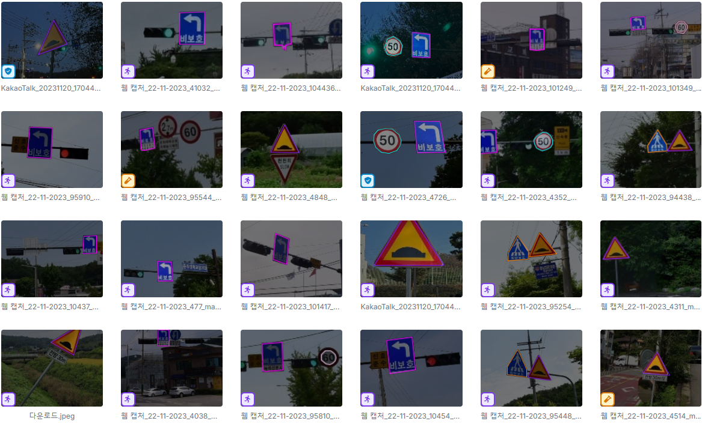

# Road Sign Images Instance Segmentation with YOLOv8

---

## Table of Contents

- [Overview](#overview)
- [Dataset](#dataset)
- [Model](#model)
- [Results](#results)
- [Project Motivation](#project-motivation)
- [Future Work](#future-work)
- [License](#license)

---

## Overview

_This project trains multiple YOLOv8 models of different parameters for instance segmentation on road sign images._

---

## Dataset

- **Source**: [PBL2 Computer Vision Model by pbl2 on Roboflow](https://universe.roboflow.com/pbl2-nsmxa/pbl2-jtrh3)
- **Description**:
  - Number of samples: `735`
  - Number of classes / labels: `15`

---

## Model

- **Type / Architecture**: YOLOv8 by Ultralytics
- **Model Variations**:
  | Model Name | Model Size       | Epoch |
  | ---------- | ---------------- | ----- |
  | yolov8n_10 | yolov8n (nano)   | 10    |
  | yolov8n_30 | yolov8n (nano)   | 30    |
  | yolov8s_10 | yolov8s (small)  | 10    |
  | yolov8s_30 | yolov8s (small)  | 30    |
  | yolov8m_10 | yolov8m (medium) | 10    |
  | yolov8m_30 | yolov8m (medium) | 30    |

---

## Results

- **Model Performances**:
  - yolov8n_10

  | Class                  | Images | Instances | Box(P | R     | mAP50 | mAP50-95) | Mask(P | R     | mAP50 | mAP50-95) |
  |------------------------|--------|-----------|-------|-------|-------|-----------|--------|-------|-------|-----------|
  | all                    | 71     | 73        | 0.91  | 0.934 | 0.976 | 0.928     | 0.91   | 0.934 | 0.976 | 0.933     |
  | School Zone            | 71     | 4         | 1     | 0.482 | 0.746 | 0.705     | 1      | 0.482 | 0.746 | 0.746     |
  | Speed Limit 20         | 71     | 2         | 0.889 | 1     | 0.995 | 0.945     | 0.889  | 1     | 0.995 | 0.945     |
  | Speed Limit 30         | 71     | 4         | 0.696 | 1     | 0.995 | 0.929     | 0.696  | 1     | 0.995 | 0.921     |
  | Speed Limit 50         | 71     | 6         | 0.919 | 0.833 | 0.972 | 0.917     | 0.919  | 0.833 | 0.972 | 0.942     |
  | Speed Limit 60         | 71     | 7         | 0.943 | 1     | 0.995 | 0.945     | 0.943  | 1     | 0.995 | 0.932     |
  | Speed Limit 70         | 71     | 3         | 0.913 | 1     | 0.995 | 0.995     | 0.913  | 1     | 0.995 | 0.995     |
  | bangjituck             | 71     | 8         | 0.99  | 1     | 0.995 | 0.89      | 0.99   | 1     | 0.995 | 0.838     |
  | crosswalk              | 71     | 8         | 1     | 0.792 | 0.982 | 0.971     | 1      | 0.792 | 0.982 | 0.956     |
  | no parking             | 71     | 3         | 0.917 | 1     | 0.995 | 0.995     | 0.917  | 1     | 0.995 | 0.995     |
  | no walking             | 71     | 2         | 0.888 | 1     | 0.995 | 0.995     | 0.888  | 1     | 0.995 | 0.995     |
  | releasespeed limit 80  | 71     | 1         | 0.84  | 1     | 0.995 | 0.895     | 0.84   | 1     | 0.995 | 0.895     |
  | roundabout             | 71     | 4         | 0.791 | 1     | 0.995 | 0.964     | 0.791  | 1     | 0.995 | 0.995     |
  | speed limit over 80    | 71     | 7         | 0.961 | 1     | 0.995 | 0.92      | 0.961  | 1     | 0.995 | 0.971     |
  | stop                   | 71     | 3         | 0.915 | 1     | 0.995 | 0.995     | 0.915  | 1     | 0.995 | 0.995     |
  | unprotected left turn- | 71     | 11        | 0.986 | 0.909 | 0.988 | 0.859     | 0.986  | 0.909 | 0.988 | 0.873     |

  - yolov8n_30

  | Class                  | Images | Instances | Box(P | R     | mAP50 | mAP50-95) | Mask(P | R     | mAP50 | mAP50-95) |
  |------------------------|--------|-----------|-------|-------|-------|-----------|--------|-------|-------|-----------|
  | all                    | 71     | 73        | 0.952 | 0.956 | 0.967 | 0.936     | 0.952  | 0.956 | 0.967 | 0.944     |
  | School Zone            | 71     | 4         | 0.987 | 0.75  | 0.788 | 0.765     | 0.987  | 0.75  | 0.788 | 0.788     |
  | Speed Limit 20         | 71     | 2         | 1     | 1     | 0.995 | 0.958     | 1      | 1     | 0.995 | 0.958     |
  | Speed Limit 30         | 71     | 4         | 0.781 | 1     | 0.845 | 0.782     | 0.781  | 1     | 0.845 | 0.824     |
  | Speed Limit 50         | 71     | 6         | 1     | 0.895 | 0.995 | 0.958     | 1      | 0.895 | 0.995 | 0.964     |
  | Speed Limit 60         | 71     | 7         | 0.895 | 1     | 0.995 | 0.995     | 0.895  | 1     | 0.995 | 0.995     |
  | Speed Limit 70         | 71     | 3         | 0.961 | 1     | 0.995 | 0.995     | 0.961  | 1     | 0.995 | 0.995     |
  | bangjituck             | 71     | 8         | 1     | 0.887 | 0.995 | 0.919     | 1      | 0.887 | 0.995 | 0.849     |
  | crosswalk              | 71     | 8         | 1     | 0.917 | 0.995 | 0.917     | 1      | 0.917 | 0.995 | 0.971     |
  | no parking             | 71     | 3         | 0.982 | 1     | 0.995 | 0.995     | 0.982  | 1     | 0.995 | 0.995     |
  | no walking             | 71     | 2         | 0.95  | 1     | 0.995 | 0.995     | 0.95   | 1     | 0.995 | 0.995     |
  | releasespeed limit 80  | 71     | 1         | 1     | 1     | 0.995 | 0.995     | 1      | 1     | 0.995 | 0.995     |
  | roundabout             | 71     | 4         | 0.797 | 0.984 | 0.945 | 0.945     | 0.797  | 0.984 | 0.945 | 0.945     |
  | speed limit over 80    | 71     | 7         | 0.984 | 1     | 0.995 | 0.93      | 0.984  | 1     | 0.995 | 0.967     |
  | stop                   | 71     | 3         | 0.967 | 1     | 0.995 | 0.995     | 0.967  | 1     | 0.995 | 0.995     |
  | unprotected left turn- | 71     | 11        | 0.976 | 0.909 | 0.988 | 0.898     | 0.976  | 0.909 | 0.988 | 0.92      |

  - yolov8s_10

  | Class                  | Images | Instances | Box(P | R     | mAP50 | mAP50-95) | Mask(P | R     | mAP50 | mAP50-95) |
  |------------------------|--------|-----------|-------|-------|-------|-----------|--------|-------|-------|-----------|
  | all                    | 71     | 73        | 0.926 | 0.944 | 0.965 | 0.908     | 0.926  | 0.944 | 0.965 | 0.929     |
  | School Zone            | 71     | 4         | 1     | 0.292 | 0.615 | 0.532     | 1      | 0.292 | 0.615 | 0.615     |
  | Speed Limit 20         | 71     | 2         | 1     | 1     | 0.995 | 0.871     | 1      | 1     | 0.995 | 0.933     |
  | Speed Limit 30         | 71     | 4         | 0.747 | 1     | 0.945 | 0.876     | 0.747  | 1     | 0.945 | 0.876     |
  | Speed Limit 50         | 71     | 6         | 0.955 | 1     | 0.995 | 0.924     | 0.955  | 1     | 0.995 | 0.963     |
  | Speed Limit 60         | 71     | 7         | 0.923 | 1     | 0.995 | 0.932     | 0.923  | 1     | 0.995 | 0.95      |
  | Speed Limit 70         | 71     | 3         | 1     | 1     | 0.995 | 0.995     | 1      | 1     | 0.995 | 0.995     |
  | bangjituck             | 71     | 8         | 0.952 | 0.875 | 0.971 | 0.885     | 0.952  | 0.875 | 0.971 | 0.806     |
  | crosswalk              | 71     | 8         | 1     | 0.986 | 0.995 | 0.995     | 1      | 0.986 | 0.995 | 0.96      |
  | no parking             | 71     | 3         | 0.927 | 1     | 0.995 | 0.995     | 0.927  | 1     | 0.995 | 0.995     |
  | no walking             | 71     | 2         | 0.862 | 1     | 0.995 | 0.995     | 0.862  | 1     | 0.995 | 0.995     |
  | releasespeed limit 80  | 71     | 1         | 0.798 | 1     | 0.995 | 0.895     | 0.798  | 1     | 0.995 | 0.995     |
  | roundabout             | 71     | 4         | 0.881 | 1     | 0.995 | 0.953     | 0.881  | 1     | 0.995 | 0.995     |
  | speed limit over 80    | 71     | 7         | 0.952 | 1     | 0.995 | 0.959     | 0.952  | 1     | 0.995 | 0.972     |
  | stop                   | 71     | 3         | 0.906 | 1     | 0.995 | 0.944     | 0.906  | 1     | 0.995 | 0.995     |
  | unprotected left turn- | 71     | 11        | 0.982 | 1     | 0.995 | 0.868     | 0.982  | 1     | 0.995 | 0.883     |

  - yolov8s_30

  | Class                  | Images | Instances | Box(P | R     | mAP50 | mAP50-95) | Mask(P | R     | mAP50 | mAP50-95) |
  |------------------------|--------|-----------|-------|-------|-------|-----------|--------|-------|-------|-----------|
  | all                    | 71     | 73        | 0.899 | 0.95  | 0.965 | 0.926     | 0.899  | 0.95  | 0.965 | 0.936     |
  | School Zone            | 71     | 4         | 1     | 0.507 | 0.766 | 0.725     | 1      | 0.507 | 0.766 | 0.766     |
  | Speed Limit 20         | 71     | 2         | 1     | 1     | 0.995 | 0.92      | 1      | 1     | 0.995 | 0.958     |
  | Speed Limit 30         | 71     | 4         | 0.606 | 1     | 0.895 | 0.83      | 0.606  | 1     | 0.895 | 0.858     |
  | Speed Limit 50         | 71     | 6         | 0.92  | 1     | 0.995 | 0.995     | 0.92   | 1     | 0.995 | 0.966     |
  | Speed Limit 60         | 71     | 7         | 0.817 | 1     | 0.995 | 0.964     | 0.817  | 1     | 0.995 | 0.981     |
  | Speed Limit 70         | 71     | 3         | 1     | 1     | 0.995 | 0.995     | 1      | 1     | 0.995 | 0.995     |
  | bangjituck             | 71     | 8         | 0.899 | 0.75  | 0.88  | 0.822     | 0.899  | 0.75  | 0.88  | 0.786     |
  | crosswalk              | 71     | 8         | 0.939 | 1     | 0.995 | 0.957     | 0.939  | 1     | 0.995 | 0.974     |
  | no parking             | 71     | 3         | 0.869 | 1     | 0.995 | 0.995     | 0.869  | 1     | 0.995 | 0.995     |
  | no walking             | 71     | 2         | 0.81  | 1     | 0.995 | 0.995     | 0.81   | 1     | 0.995 | 0.995     |
  | releasespeed limit 80  | 71     | 1         | 1     | 1     | 0.995 | 0.995     | 1      | 1     | 0.995 | 0.995     |
  | roundabout             | 71     | 4         | 0.884 | 1     | 0.995 | 0.995     | 0.884  | 1     | 0.995 | 0.995     |
  | speed limit over 80    | 71     | 7         | 0.931 | 1     | 0.995 | 0.971     | 0.931  | 1     | 0.995 | 0.964     |
  | stop                   | 71     | 3         | 0.864 | 1     | 0.995 | 0.864     | 0.864  | 1     | 0.995 | 0.942     |
  | unprotected left turn- | 71     | 11        | 0.95  | 1     | 0.995 | 0.871     | 0.95   | 1     | 0.995 | 0.867     |

  - yolov8m_10

  | Class                  | Images | Instances | Box(P | R     | mAP50 | mAP50-95) | Mask(P | R     | mAP50 | mAP50-95) |
  |------------------------|--------|-----------|-------|-------|-------|-----------|--------|-------|-------|-----------|
  | all                    | 71     | 73        | 0.87  | 0.956 | 0.965 | 0.926     | 0.87   | 0.956 | 0.965 | 0.926     |
  | School Zone            | 71     | 4         | 1     | 0.501 | 0.753 | 0.712     | 1      | 0.501 | 0.753 | 0.753     |
  | Speed Limit 20         | 71     | 2         | 0.815 | 1     | 0.995 | 0.948     | 0.815  | 1     | 0.995 | 0.948     |
  | Speed Limit 30         | 71     | 4         | 0.73  | 1     | 0.796 | 0.726     | 0.73   | 1     | 0.796 | 0.738     |
  | Speed Limit 50         | 71     | 6         | 1     | 0.966 | 0.995 | 0.944     | 1      | 0.966 | 0.995 | 0.96      |
  | Speed Limit 60         | 71     | 7         | 0.829 | 1     | 0.995 | 0.918     | 0.829  | 1     | 0.995 | 0.963     |
  | Speed Limit 70         | 71     | 3         | 1     | 1     | 0.995 | 0.94      | 1      | 1     | 0.995 | 0.995     |
  | bangjituck             | 71     | 8         | 0.946 | 1     | 0.995 | 0.938     | 0.946  | 1     | 0.995 | 0.835     |
  | crosswalk              | 71     | 8         | 1     | 0.957 | 0.995 | 0.981     | 1      | 0.957 | 0.995 | 0.966     |
  | no parking             | 71     | 3         | 0.857 | 1     | 0.995 | 0.995     | 0.857  | 1     | 0.995 | 0.995     |
  | no walking             | 71     | 2         | 0.595 | 1     | 0.995 | 0.995     | 0.595  | 1     | 0.995 | 0.995     |
  | releasespeed limit 80  | 71     | 1         | 0.705 | 1     | 0.995 | 0.995     | 0.705  | 1     | 0.995 | 0.895     |
  | roundabout             | 71     | 4         | 0.836 | 1     | 0.995 | 0.995     | 0.836  | 1     | 0.995 | 0.995     |
  | speed limit over 80    | 71     | 7         | 0.93  | 1     | 0.995 | 0.947     | 0.93   | 1     | 0.995 | 0.958     |
  | stop                   | 71     | 3         | 0.861 | 1     | 0.995 | 0.995     | 0.861  | 1     | 0.995 | 0.995     |
  | unprotected left turn- | 71     | 11        | 0.945 | 0.909 | 0.988 | 0.857     | 0.945  | 0.909 | 0.988 | 0.898     |

  - yolov8m_30

  | Class                  | Images | Instances | Box(P | R     | mAP50 | mAP50-95) | Mask(P | R     | mAP50 | mAP50-95) |
  |------------------------|--------|-----------|-------|-------|-------|-----------|--------|-------|-------|-----------|
  | all                    | 71     | 73        | 0.939 | 0.971 | 0.98  | 0.931     | 0.939  | 0.971 | 0.98  | 0.939     |
  | School Zone            | 71     | 4         | 1     | 0.739 | 0.775 | 0.725     | 1      | 0.739 | 0.775 | 0.775     |
  | Speed Limit 20         | 71     | 2         | 0.912 | 1     | 0.995 | 0.925     | 0.912  | 1     | 0.995 | 0.925     |
  | Speed Limit 30         | 71     | 4         | 0.73  | 1     | 0.995 | 0.923     | 0.73   | 1     | 0.995 | 0.936     |
  | Speed Limit 50         | 71     | 6         | 0.975 | 1     | 0.995 | 0.921     | 0.975  | 1     | 0.995 | 0.953     |
  | Speed Limit 60         | 71     | 7         | 0.86  | 1     | 0.995 | 0.959     | 0.86   | 1     | 0.995 | 0.995     |
  | Speed Limit 70         | 71     | 3         | 0.931 | 1     | 0.995 | 0.995     | 0.931  | 1     | 0.995 | 0.995     |
  | bangjituck             | 71     | 8         | 1     | 0.905 | 0.995 | 0.925     | 1      | 0.905 | 0.995 | 0.907     |
  | crosswalk              | 71     | 8         | 0.997 | 1     | 0.995 | 0.939     | 0.997  | 1     | 0.995 | 0.948     |
  | no parking             | 71     | 3         | 1     | 0.922 | 0.995 | 0.995     | 1      | 0.922 | 0.995 | 0.995     |
  | no walking             | 71     | 2         | 1     | 1     | 0.995 | 0.995     | 1      | 1     | 0.995 | 0.995     |
  | releasespeed limit 80  | 71     | 1         | 0.859 | 1     | 0.995 | 0.895     | 0.859  | 1     | 0.995 | 0.895     |
  | roundabout             | 71     | 4         | 0.941 | 1     | 0.995 | 0.995     | 0.941  | 1     | 0.995 | 0.995     |
  | speed limit over 80    | 71     | 7         | 0.965 | 1     | 0.995 | 0.948     | 0.965  | 1     | 0.995 | 0.959     |
  | stop                   | 71     | 3         | 0.937 | 1     | 0.995 | 0.995     | 0.937  | 1     | 0.995 | 0.995     |
  | unprotected left turn- | 71     | 11        | 0.981 | 1     | 0.995 | 0.837     | 0.981  | 1     | 0.995 | 0.814     |

---

## Project Motivation

_This project is made by a team for the purposes of a university course project._

---

## Future Work

_This project could be improved with more training data, image preprocessing, and a more customized model with optimized hyperparameters_

---

## License

This project is licensed under the MIT License.

> Note: This project uses a model trained on the PBL2 Computer Vision Model dataset provided by Roboflow. The dataset is subject to Roboflow's terms of use and is not redistributed here.